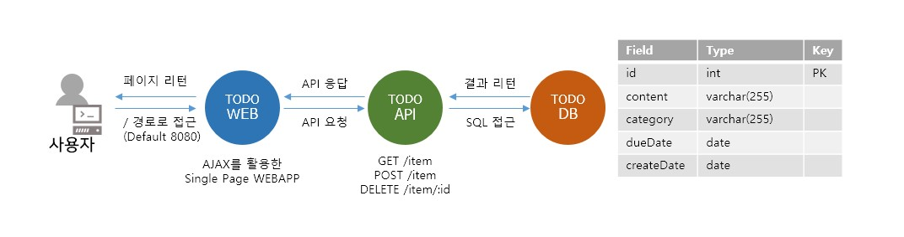

# Cloudnative_todoapp
컨테이너 기반의 3 tier 애플리케이션 샘플


- DB: Mysql 5.7 > 컨테이너 생성시 데이터 초기화 및 샘플데이터 생성

- API: Node.js > todoitem에 대한 리스트, 생성, 삭제

- WEB: Node.js > ejs템플릿 사용 싱글 웹앱

#### todoapi
node.js 코드로 구현한 싱글페이지웹앱 애플리케이션입니다.

디렉토리
```bash
|-- Dockerfile  
|-- README.md   
|-- app.js 
|-- package-lock.json
|-- package.json
`-- views
    |-- img
    |   `-- loading.gif
    |-- index.ejs
    `-- js
        `-- app.js
```

#### todoweb
node.js 코드로 구현한 싱글페이지웹앱 애플리케이션입니다.

```bash
|-- Dockerfile  
|-- README.md   
|-- app.js 
|-- package-lock.json
|-- package.json
`-- views
    |-- img
    |   `-- loading.gif
    |-- index.ejs
    `-- js
        `-- app.js
```

#### tododbsingle
mysql 5.7 컨테이너 데이터베이스입니다.

```bash
|-- Dockerfile   
|-- README.md    
|-- config  
|   `-- mysql.cnf
|-- init-data.sh 
`-- sql  
    |-- 01_ddl.sql
    `-- 02_dml.sql
```
